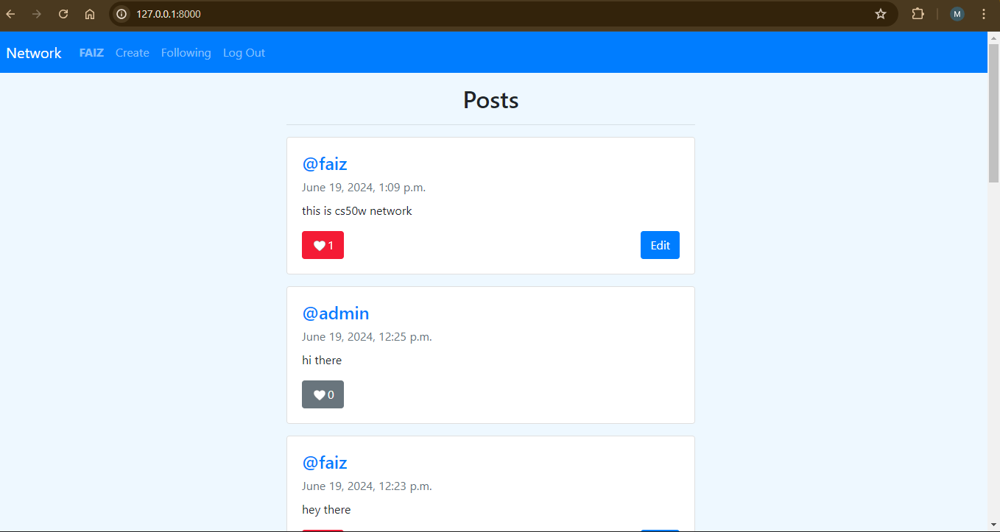

# CS50W Network Project

## Description

This project is a social network web application built using Python, JavaScript, HTML, and CSS for the CS50W course. Users can create posts, follow others, like posts, and more.

## Demo

Watch the project demo on [YouTube](https://youtu.be/dnpOKZpoziM).


_Caption: This is a screenshot of the CS50W Network Project._

## Features

- **Create Post**: Write a new text-based post.
- **All Posts**: View all posts from all users.
- **Profile Page**: View user profiles, their posts, and follow/unfollow them.
- **Following Page**: See posts only from users the current user follows.
- **Pagination**: Navigate through posts with 'Next' and 'Previous' buttons.
- **Edit Post**: Edit your own posts and save changes without reloading the page.
- **Like/Unlike**: Like or unlike posts with instant updates to the like count.

1. **Clone the repository:**
   ```bash
   git clone https://github.com/me50/mahamadfaizpatel.git
   cd PROJECT4
   ```
2. **Install dependencies:**
   ```bash
   pip install -r requirements.txt
   ```
3. **Apply migrations:**
   ```bash
   python manage.py migrate
   ```
4. **python manage.py createsuperuser**
   ```bash
   python manage.py createsuperuser
   ```
5. **Run the server:**
   ```bash
   python manage.py runserver
   ```
6. **Open http://127.0.0.1:8000/ in your web browser**

## Usage

- **Sign Up/Login**: Register a new account or log in with existing credentials.
- **Create Post**: Use the text area to compose and submit new posts.
- **View All Posts**: Navigate to 'All Posts' to see posts from all users.
- **Profile Page**: Click on any username to view their profile and follow/unfollow them.
- **Following Page**: Navigate to 'Following' to see posts from users you follow.
- **Pagination**: Use the "Next" and "Previous" buttons to navigate through pages of posts.
- **Edit Post**: Click "Edit" on your posts to modify and save changes.
- **Like/Unlike Post**: Click the "Like" button on any post to toggle the like status.

## License

This project is licensed under the MIT License.
